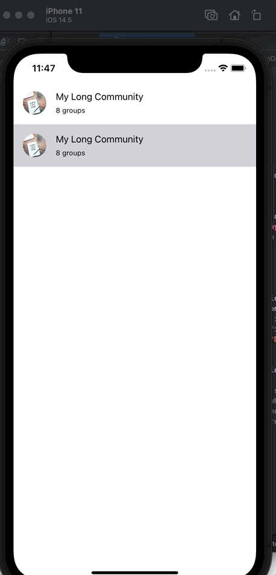

# CustomizedActionSheet
CustomizedActionSheet is using UIPresentationController that allows modals to be presented like a bottom sheet.
- Dragging up and down
- Swipe down to close
- Tap out to dismiss
- Setup dimming background

# Demo

       
